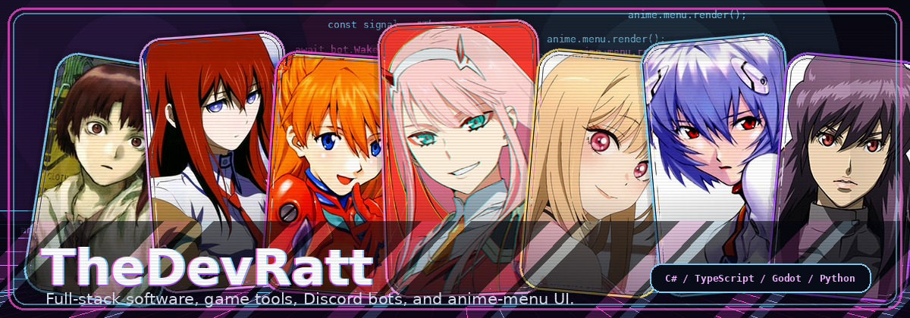

<div align="center">
  
</div>

<h1 align="center">TheDevRatt</h1>

<p align="center">
  <code>Anime-Coded Software</code> ·
  <code>Game Dev Side Quests</code> ·
  <code>Discord Bots With Personality</code> ·
  <code>Useful Tools With Style</code>
</p>

<div align="center">
  
  
  
  
</div>

```txt
Profile      TheDevRatt
Class        Full-stack developer off the main route
Build        C#/.NET, TypeScript, React, Angular
Alt Build    Godot, Python, SQL, Discord tooling
Status       Building useful software with visual-novel menu energy
```

## Now Airing

I build web apps, Discord bots, game tools, and small utilities that usually start as odd little ideas and become real software.

The sweet spot is practical software with a bit of taste: bots that feel personal, tools that remove boring work, game systems that make C# and Godot behave, and interfaces that look more like a late-night anime menu than a tax form.

This page is not trying to be a corporate brochure. It is the side of my work that likes polished systems, weird menus, and overbuilt side quests.

## Loadout

<div align="center">
  
</div>

```txt
Frontend      TypeScript, React, Angular
Backend       C#, ASP.NET, SQL Server, Node.js
Game Tools    Godot 4, C#, Steamworks experiments
Side Magic    Python scripts, Discord bots, UI polish
```

## Featured Quests

<div align="center">
  <a href="https://github.com/TheDevRatt/Manifold">
    
  </a>
  <a href="https://github.com/TheDevRatt/ChizuChan">
    
  </a>
  <a href="https://github.com/TheDevRatt/Discord-Cropper">
    
  </a>
  <a href="https://github.com/TheDevRatt/habitat-pkr-app">
    
  </a>
</div>

## Current Fixations

```txt
[01] Godot and C# tooling
[02] Steamworks integration
[03] Discord bots with character
[04] Game-menu and anime-menu UI
[05] Tiny automations for annoying chores
[06] Software that feels personal instead of sterile
```

## Signal

<div align="center">
  
  
</div>

<div align="center">
  <sub>Profile views, because number go up still works on me.</sub>
  <br />
  
</div>
