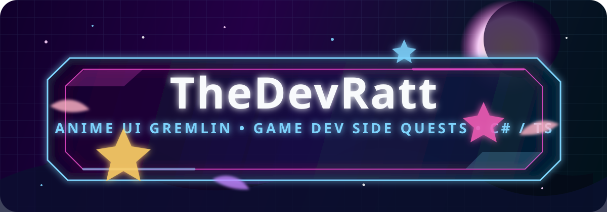

<div align="center">
  
</div>

<div align="center">
  
</div>

<div align="center">
  
  
  
</div>


```txt
╭─ current save file ─────────────────────────────────────╮
│ handle        TheDevRatt                                │
│ class         full-stack dev / game-tools gremlin        │
│ main weapon   C# + .NET                                  │
│ alt weapon    TypeScript + React + Angular               │
│ side quests   Godot, Steamworks, Discord bots, UI magic  │
│ weakness      "what if this had a little more personality" │
╰──────────────────────────────────────────────────────────╯
```

## now playing

I build web apps, bots, game tools, and tiny utilities that usually start with "this is probably a bad idea" and then become real anyway.

The serious stack is C#/.NET, TypeScript, React, Angular, SQL Server, Python, Java, and Godot. The less serious but equally important stack is anime menus, RPG HUDs, Discord gremlins, rhythm-game brainrot, and making software feel like it has a soul instead of a corporate onboarding flow.

I like projects that are clean under the hood but still have some sparkle on the surface. If the UI looks like a magic terminal from a game that should have had a 24-episode anime adaptation, I'm probably having a good time.

## party loadout

<div align="center">
  
</div>

```txt
frontend      React / Angular / TypeScript
backend       C# / ASP.NET / SQL Server / Node
game stuff    Godot 4 / C# / Steamworks experiments
utility       Python / Git / Figma / whatever solves the problem
```


## quest log

<div align="center">
  <a href="https://github.com/TheDevRatt/Manifold">
    
  </a>
  <a href="https://github.com/TheDevRatt/ChizuChan">
    
  </a>
  <a href="https://github.com/TheDevRatt/Discord-Cropper">
    
  </a>
  <a href="https://github.com/TheDevRatt/habitat-pkr-app">
    
  </a>
</div>

## recurring arcs

- building game-adjacent tools that make Godot and C# play nicer together
- making Discord bots feel more like characters and less like appliances
- turning small annoyances into weirdly polished utilities
- chasing UI that lands somewhere between command center, visual novel, and arcade cabinet
- learning systems deeply enough to make them behave
- occasionally overengineering something because the bit was funny

## activity feed

<div align="center">
  
  
</div>


<div align="center">
  <sub>profile views, because number go up makes the goblin brain happy</sub>
  <br />
  
</div>
