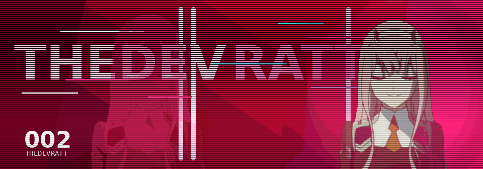

<div align="center">
  
</div>

<h1 align="center">TheDevRatt</h1>

<p align="center">
  <code>C# / .NET</code> ·
  <code>TypeScript</code> ·
  <code>Godot</code> ·
  <code>Discord Bots</code> ·
  <code>Steamworks</code>
</p>

<div align="center">
  
  
  
  
</div>

```txt
PLAYER       TheDevRatt
ROLE         Full-stack dev with game-menu instincts
MAIN STACK   C#/.NET, TypeScript, React, Angular
SIDE QUESTS  Godot, Steamworks, Discord bots, Python automation
CURRENT ARC  Useful software with a little more style than necessary
```

## Profile

I build web apps, Discord bots, game tools, and small utilities that usually start as a side quest and turn into something real.

Most of my work lives somewhere between practical software and weird interface energy: tools that remove boring work, bots that feel less disposable, C# systems that behave, and UI that would rather look like a late-night game menu than a tax form.

This is the public save file. Projects, experiments, current fixations, and the occasional overbuilt idea that refused to stay small.

## Showcase slots

| Slot | Project | What it is |
| --- | --- | --- |
| `01` | [Manifold](https://github.com/TheDevRatt/Manifold) | Godot-first C# / Steamworks SDK work. The goal is to make Steam integration feel less like ritual combat. |
| `02` | [ChizuChan](https://github.com/TheDevRatt/ChizuChan) | Discord bot work with personality, utility, and enough routing logic to keep things interesting. |
| `03` | [Discord-Cropper](https://github.com/TheDevRatt/Discord-Cropper) | A TypeScript tool for making Discord image crops less annoying. Tiny problem, real quality-of-life win. |
| `04` | [Rhythm-Game](https://github.com/TheDevRatt/Rhythm-Game) | A Godot rhythm-game experiment. Small scope, good game-feel practice, and very on-brand side-quest material. |

<div align="center">
  <a href="https://github.com/TheDevRatt/Manifold">
    
  </a>
  <a href="https://github.com/TheDevRatt/ChizuChan">
    
  </a>
  <a href="https://github.com/TheDevRatt/Discord-Cropper">
    
  </a>
  <a href="https://github.com/TheDevRatt/Rhythm-Game">
    
  </a>
</div>

## Loadout

<div align="center">
  
</div>

```txt
Frontend     TypeScript, React, Angular, HTML/CSS
Backend      C#, ASP.NET, SQL Server, Node.js
Game Dev     Godot 4, C#, Steamworks experiments
Tools        Python scripts, Git/GitHub, Figma, Discord APIs
```

## Current quests

```txt
[01] Manifold and C# Steamworks bindings
[02] Godot tooling that does not fight the developer
[03] Discord bots with actual character
[04] Game-menu UI that still gets out of the way
[05] Small automations for repeated annoyances
[06] Software that feels personal instead of sterile
```

## Signal

<div align="center">
  
  
</div>

<div align="center">
  <sub>Profile views, because number go up still works on me.</sub>
  <br />
  
</div>
